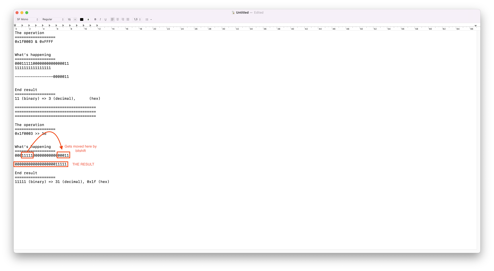

# What is this?

This, kind user, is a markdown file where we explain how to properly construct the PCI path of a PCI device on all platforms.

Enjoy!

# Linux

The only situation where it's applicable (as far as I know) to construct a PCI path via PCIDebug is on Linux. There, we would want to look at the amount of “path components” the device's ACPI path contains past `\_SB.PCI0`; so let's say we had <ins>`\_SB.PCI0.GFX0`</ins>, this would mean that there should only be a singular PCI path component (excluding `PciRoot()`) in the final path. Say that this device's PCIDebug was <ins>`0000:00:02.0`</ins>, we would want to set `PciRoot(...)` (where the value inside of is the hex representation of the domain – `0000` -> `0x0`), then we'd take a look at the device ID (`02`) and function value (`.0`). 

From here, we construct the following PCI path: <ins>`PciRoot(0x0)/Pci(0x2,0x0)`</ins>

```
PciRoot(0x0)/Pci(0x2,0x0)
        ||       ||  | _ _ _ _ Function (0 => 0x0)
        ||       ||
        ||       | _ _ _ _ Device ID (02 => 0x2)
        | _ _ _ _ Domain value (0000 => 0x0)
```

However, if the ACPI path has more than a singular “path component,” we'd want to traverse `/sys/bus/pci/devices` and look for an entry that matches the device's PCIDebug value.

So let's take for example: <ins>`\_SB.PCI0.PEG0.PEGP`</ins>

Its PCIDebug value is <ins>`0000:00:01.0`</ins>, initially.

As previously mentioned, we'll traverse `/sys/bus/pci/devices` and look for a match.
In this example, we have found it: `/sys/bus/pci/devices/0000:00:01.0`; inside of this directory, we may or may not find a few other directories which also have their own PCIDebug values, they'll also, most likely, include `pcie` in their directory name.

Looking back at the amount of path components our ACPI path (`\_SB.PCI0.PEG0.PEGP`) has, we can see that it's `2` (after removing `\_SB.PCI0`), and since we already have the first PCIDebug value, we'd want to take the first entry inside of the parent entry's directory (`/sys/bus/pci/devices/0000:00:01.0`); from where we may find the following:

- `0000:00:01.0:pcie002`
- `0000:00:01.0:pcie010`

We'll want to take the first entry found (`*:pcie002`), since we need only 1 additional PCIDebug value. We extract the PCIDebug by slicing off `:pcie002`, and that'll be the second PCI path component. Which finally yields:

<ins>`PciRoot(0x0)/Pci(0x1,0x0)/Pci(0x0,0x0)`</ins>

# Windows

On Windows it's pretty much just a matter of properly slicing a string and splitting it – `PCIROOT(0)#PCI(0100)#PCI(0000)` -> `PciRoot(0x0)/Pci(0x1,0x0)/Pci(0x0,0x0)`

__Logic behind the Windows implementation__: <https://github.com/KernelWanderers/OCSysInfo/blob/main/src/util/pci_root.py#L50-L129>

# macOS

On macOS, it's slightly more convoluted, but ultimately equally as accurate and proper. 

__Logic behind the macOS implementation__ (special thank we to DhinakG and rest of the Dortania team for allowing us to copy over this implementation into OCSysInfo): <https://github.com/KernelWanderers/OCSysInfo/blob/main/src/util/pci_root.py#L14-L76>

Before this more improved and proper logic on macOS, we previously had looked at its “location in plane” value.

Here's an example of that: <ins>`IOACPIPlane:/_SB/PCI0@0/HDAS@1f0003`</ins>

We'd just remove `IOACPIPlane:/`, and then split by `/`, which would yield:

- `["_SB", "PCI0@0", "HDAS@1f0003"]`

We'd then traverse this list and first take care of `_SB`, as you can see, it doesn't include a `@` in its value, which is normal, but the rest of these components include their domain (`PCI0` in this example) or device id + function (`HDAS` in this example), so we'd just append `\_SB` to the “formatted list,” and then take care of the rest if it has the `@` value. 

If it does include the `@` value, we'd split on it, append the first value (e.g. `PCI0`) to the final ACPI path, and, before using bitshifts to extract device id and function values, check if the ACPI value is `PCI0`, in which case it'd be our `PciRoot()`, otherwise, it'd be `Pci()`

After we encounter <ins>`HDAS@1f0003`</ins>, from here, we of course split on `@` and append the former value to the ACPI path, and deal with the latter value with bitshifts:

```py
acpi, pcid = val.split("@")

pcid = int(pcid, 16)

device_id = hex(pcid >> 16 & 0xFFFF) #  -> 0x1f
function  = hex(pcid & 0xFFFF)       #  -> 0x3
```

Here's what's happening with the bitshifts, in case you wanted to know:

