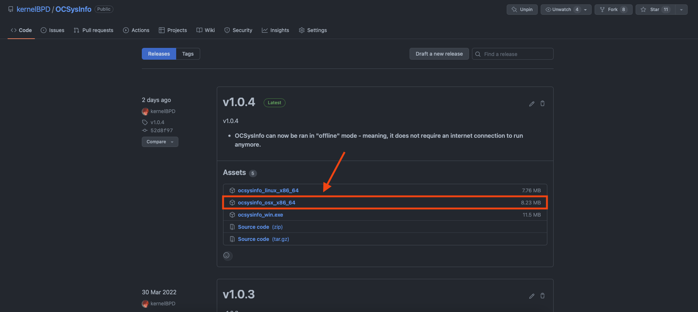
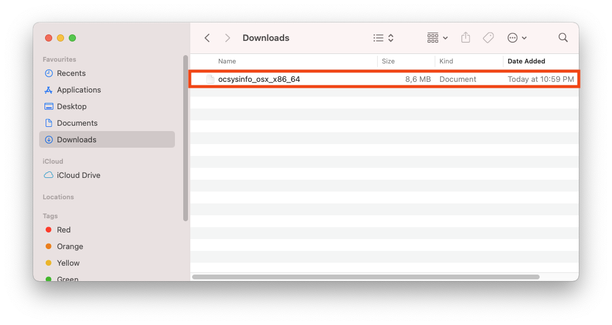
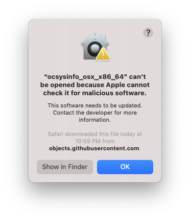
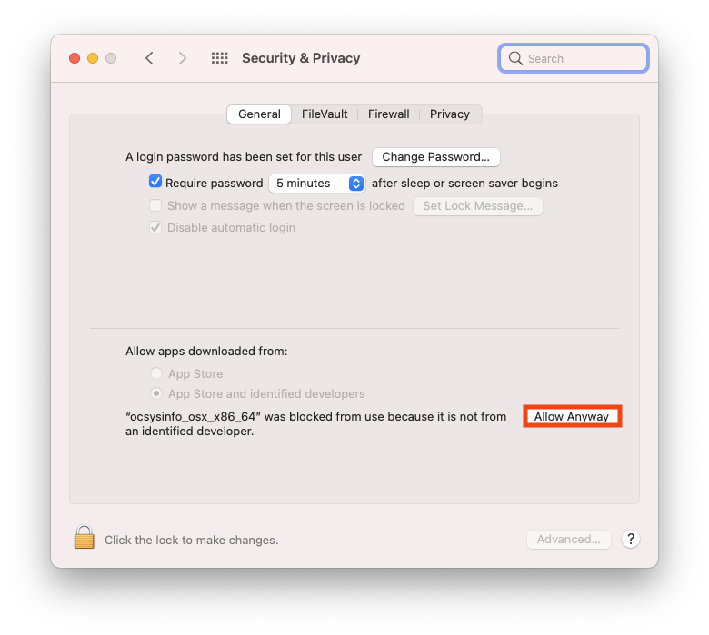
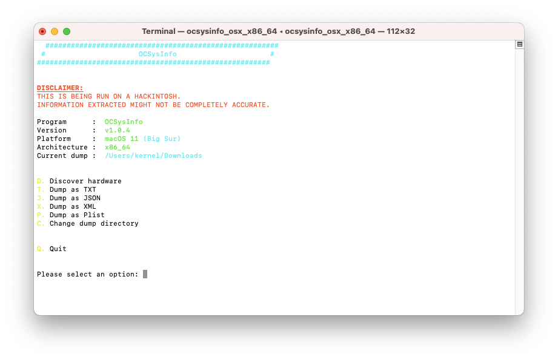
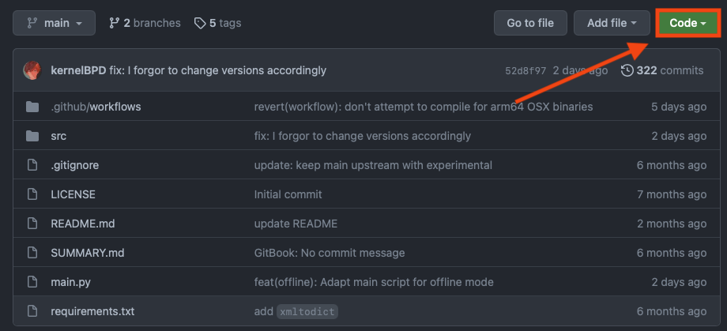
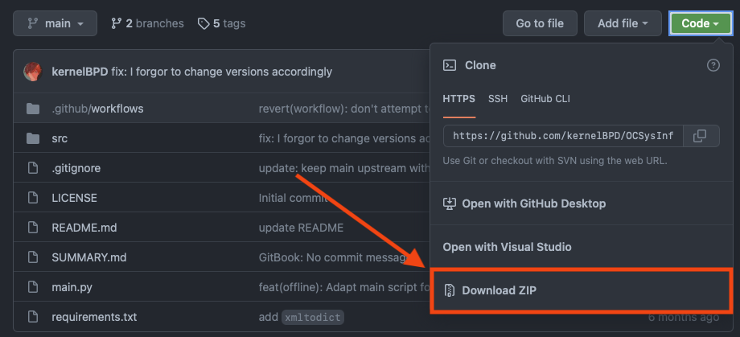

## How to install

There’s really only two ways of running OCSysInfo:
    
  - Using a precompiled binary and running the executable (method A)
  - Downloading the source code & running it using Python (method B)

We will demonstrate both methods.

<br />

## Method A (using a precombiled binary)

This is the simplest and easiest method. You simply go over to the [releases](https://github.com/KernelWanderers/OCSysInfo/releases) page, and download an executable for your OS. <br />

In this example, we’re on an Intel machine running macOS, so we’d want to download the `osx_x86_64` binary. 




If we look at the second image, we can see that it’s located in `Downloads`, which we will be accessing via the terminal.

So, for our case, we would want to do something like this:

```sh
# Redirect into the Downloads folder
cd ~/Downloads

# Give executable permissions to the binary
chmod +x ./ocsysinfo_osx_x86_64

# Run the executable
./ocsysinfo_osx_x86_64
```

If you get an alert like shown below, it’s completely normal. Just keep following.



If you get this alert (which is highly likely), press `OK`. <br /> 
Then go into __System Preferences -> Security & Privacy__ and click on `Allow Anyway`:



Afterwards, simply run the executable again. If you get a pop-up alert again, simply press `Open`. <br />
And voila! OCSysInfo should be up and running.



<br />

## Method B (downloading the source code)

Before we start, please ensure that you have Python 3.9 or later installed onto your machine. As this is the __PRIMARY__ prerequisite in order to run the application. <br />
If you don’t have Python installed, please head over to [Python’s official website](https://www.python.org/downloads/) to download and install it.

Firstly, you’ll want to download the source code of the project, either by downloading it as a `.zip` file from GitHub, or by using `git clone`. <br /> <br />

## Downloading it manually through GitHub’s website




<br />

Afterwards, you should have a file of the source code – extract it and go to [installing dependencies and running the app](#installing-dependencies-and-running-the-app) for further instructions.

<br />

## Downloading via `git clone`

Redirect to a place in your machine where you want to git clone the project in. 
In this example, we redirected into `~/Documents`.

```sh
# Redirecting to a place where we will git clone the project inside of
cd ~/Documents 

# Git cloning the project
git clone https://github.com/KernelWanderers/OCSysInfo.git

# Redirecting into the project's source code
cd OCSysInfo
```

<br />

## Installing dependencies and running the app

Before we begin, please ensure once more that you have Python 3.9 or later installed. A quick way to verify this is by running:

```sh
python --version

# If you get a result back saying Python 2.x.x, try:
python3 --version
```

If either of the aforementioned commands has returned `Python 3.9.x` or greater, you should be set to carry on. <br />
However, if you got an error running either of these commands, or `python --version` returned `Python 2.x.x` but `python3 --version` threw an error, it is likely that you do not have Python 3.9 or later installed on your machine.

**As far as installing the dependencies goes, it’s fairly straight-forward; simply run:**
```sh
python -m pip install -r requirements.txt

# Or, if python3 is the >=Python 3.9 alias:
python3 -m pip install -r requirements.txt
```

Although the application _should_ prompt you if it detects that you haven’t installed any of the dependencies, and will run an interactive TUI, so to speak, where you can choose to install each dependency separately, or not. <br />


<u>IMPORTANT</u>: OCSysInfo needs **ALL** dependencies (relative to the OS it’s being ran on) in order to run properly. 


<u>For users running macOS</u>: The dependency installation process may take awhile since it has to install `pyobjc`, which is a massive library – don’t panic, it’s normal.


## Running the application

Finally! You’ve made it to the last step of this method — running the application. Simply run:

```sh
python main.py

# Or, if python3 is the >=Python 3.9 alias:
python3 main.py
```

Voila! OCSysInfo should be up and running.


You can now move onto the next section — [OCSysInfo Usage](/usage.md)